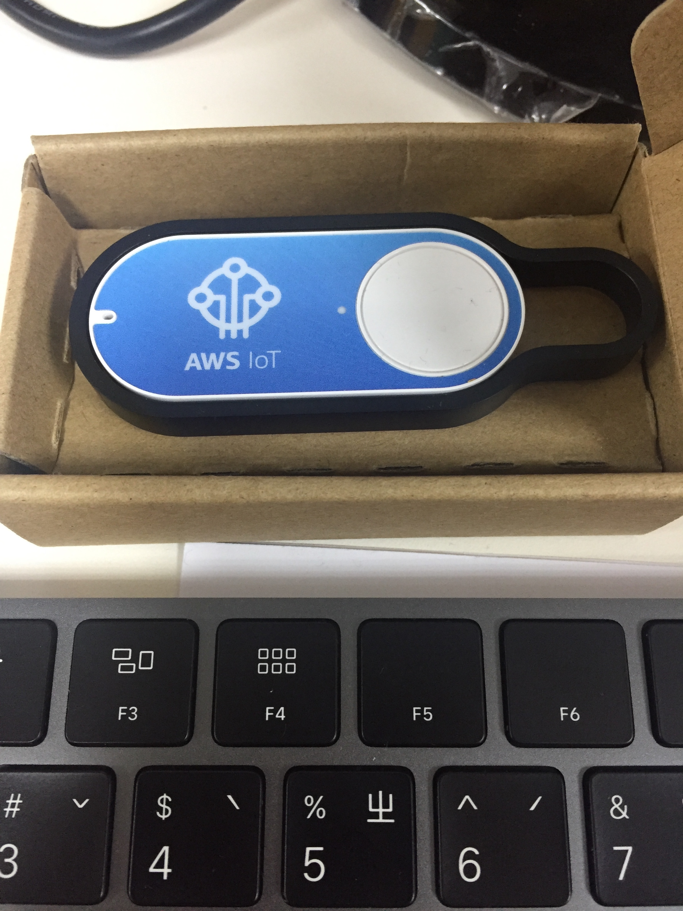

# Revise History
| Version   | Issue date | Editor | Comment      |
| :-------: | :--------: | :----: | :----------: |
| Curveball | 2018/06/18 | Kevin  | Demo version |

# Table Of Contents
- 1.0 General Informaion
  - 1.1 What is AWS IoT Core
  - 1.2 What is AWS IoT Button 
  - 1.3 What is MQTT

- 2.0 System Demo
  - 2.1 Create a thing (link)
  - 2.2 Use the link to control the lock

## 1.0 GENERAL INFORMATION
We will use AWS IoT core as the new generation smart lock backend service. The following demo code
illustrates how to use **AWS cli** to create a IoT device and attach certificate and policy to the device, in order to make the physical device (smart lock) communicate with AWS IoT core.

### 1.1 What is AWS IoT Core
[AWS IoT Core Introduction](https://aws.amazon.com/iot-core/?nc1=h_ls)

### 1.2 What is AWS IoT Button

AWS IoT Button has nothing to do with this demo code, but simulates a physical device.

[AWS Button](https://aws.amazon.com/iotbutton/faq/?nc1=h_ls)

{width=50%}

### 1.3 What is MQTT

Read the following document to understand MQTT protocol.

[MQTT](https://www.ibm.com/support/knowledgecenter/zh-tw/SSFKSJ_7.5.0/com.ibm.mm.tc.doc/tc00000_.htm)

## 2.0 System Demo

After cloning this repository from github, 
change the **HOST** parameter in **appConfig.json** file.


type in the following command: 
``` bash
$ node app_main.js
```


and enter the testing web portal: http://127.0.0.1:8787.


### 2.1 Create a thing (link)

Create a thing (link) from testing web portal


After refreshing AWS IoT web page, you can see the new thing (link) on the page.


Also, the testing web portal will display the new thing (link) you created.


### 2.2 Use the link to control the lock
Click the **Open Door** button to open the door which is controled by the thing **test0617**.


AWS IoT provides MQTT testing tools to verify if the messages are sent to the correct subscribers.


